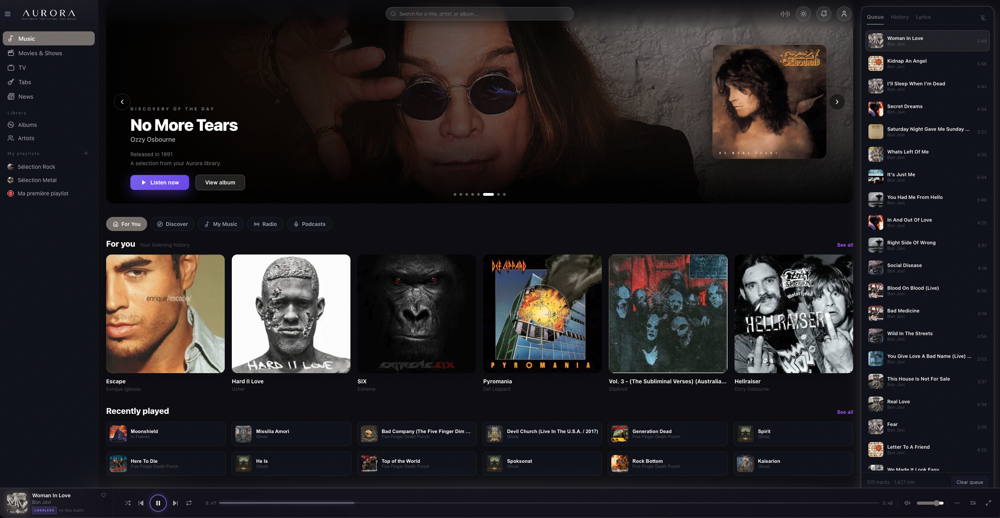
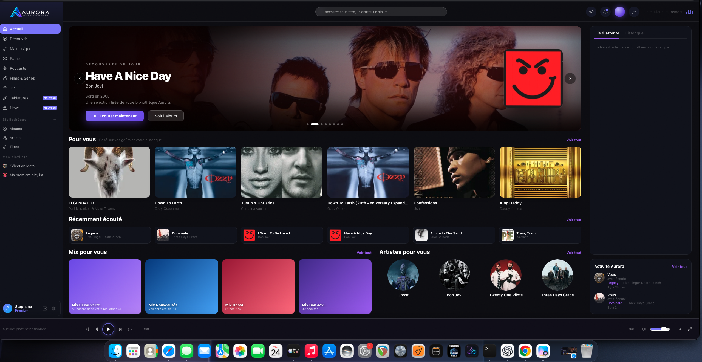
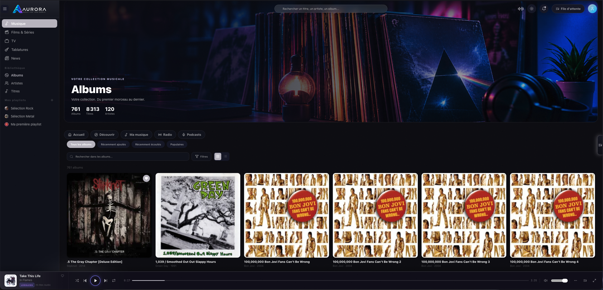
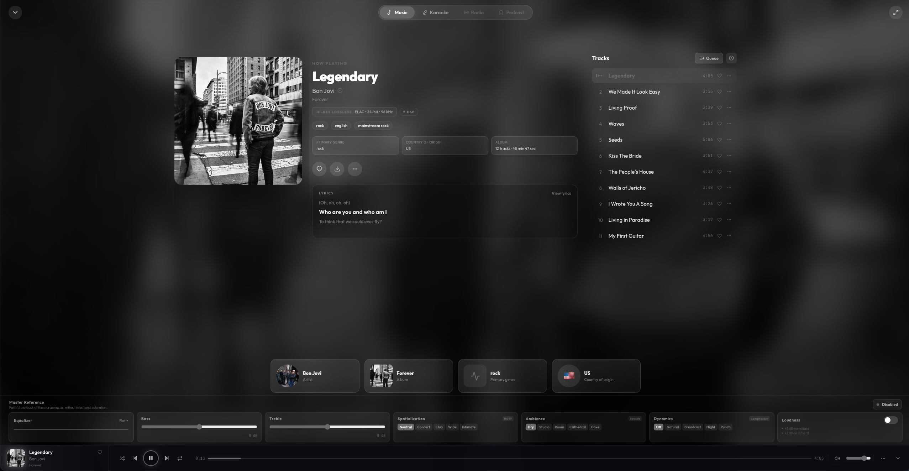
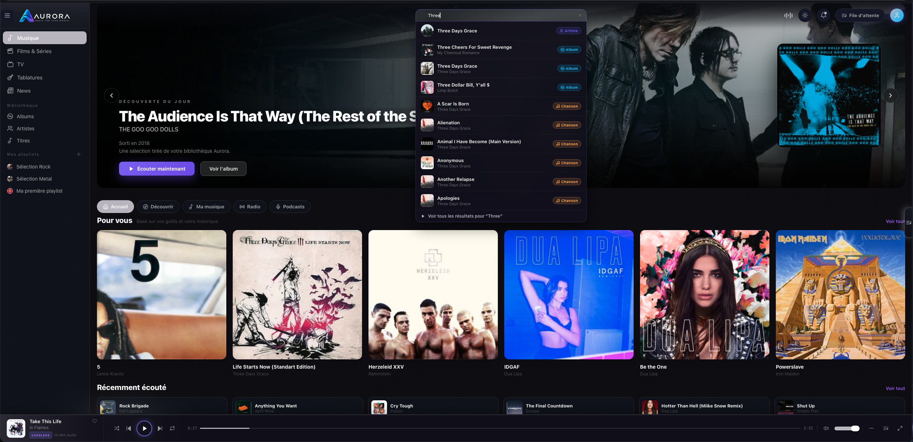
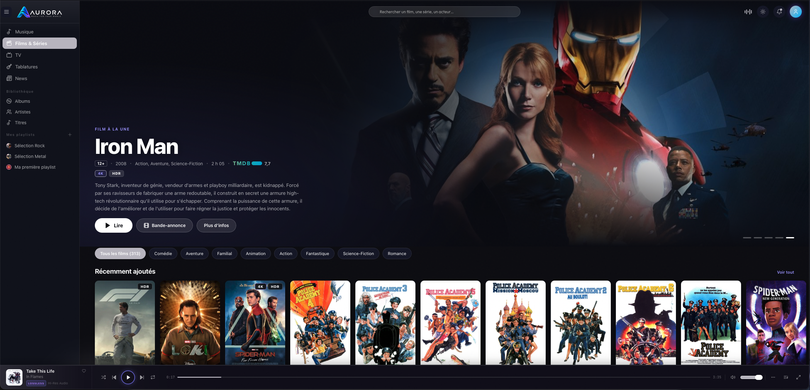
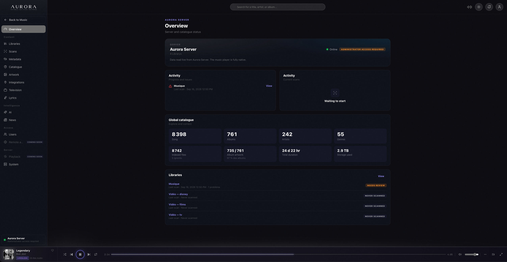

<p align="center">
  
</p>

<p align="center">
  <strong>Your media. Your server. Your world.</strong>
</p>

<p align="center">
  Your personal self-streaming platform for music, movies, series, TV, karaoke, guitar, news and more.
</p>

<p align="center">
  <strong>Private. Local. Yours.</strong>
</p>

<hr>

<div align="center">

<h2>🧪 Aurora Early Access</h2>

<p>
Aurora is getting closer to its first public release.
</p>

<p>
We're looking for early testers who want to experience Aurora,<br>
share feedback and help us polish the experience before launch.
</p>

<p>
<strong>Music · Movies · Series · TV · Karaoke · Guitar Tabs · News</strong>
</p>

<h3>🌌 Be among the first to experience Aurora.</h3>

<p>
<a href="EARLY_ACCESS.md">
Learn more about Aurora Early Access
</a>
</p>

<p>
<a href="https://github.com/Whassup2k1/Aurora/discussions/1">
<strong>→ Join the Aurora Beta Testing Program</strong>
</a>
</p>

</div>

<hr>

<p align="center">
  <a href="INSTALLATION.md">Installation</a> •
  <a href="FEATURES.md">Features</a> •
  <a href="#screenshots">Screenshots</a> •
  <a href="#roadmap">Roadmap</a> •
  <a href="#contributing">Contribute</a> •
  <a href="SUPPORT.md">Support</a> •
  <a href="PRIVACY.md">Privacy</a>
</p>

---

<p align="center">
  
</p>

---

## ✨ What is Aurora?

Aurora is a modern, self-hosted multimedia platform designed to bring your personal media into one unified experience.

It started as a music player.

It is becoming much more.

Aurora is being built as a complete personal entertainment platform combining music, movies, series, live TV, karaoke, guitar tools, news and server management inside one modern interface.

Instead of feeling like a traditional media server control panel, Aurora is designed to feel like a real streaming product — while keeping your library and infrastructure under your control.

📖 **[Explore all Aurora features](FEATURES.md)**

> **Your media. Your server. Your world.**

---

## 🎵 Music

Aurora brings your music library into the same premium experience as the rest of your media.

Built for high-quality local playback, Aurora combines your albums, artists, playlists and favorites with rich artwork, powerful discovery and advanced audio features.

Current and planned music features include:

- Native music library
- Album and artist browsing
- FLAC and high-quality audio playback
- HTTP Range streaming and seeking
- Play queue
- Favorites
- Playlists
- Global search
- Rich artist and album artwork
- Metadata enrichment
- Advanced audio processing
- Equalizer
- Master Reference audio mode
- Fullscreen player
- Multi-user support

---

## 🎤 Karaoke

Aurora is also being designed as a complete karaoke environment.

The goal is to provide:

- Synchronized lyrics
- Fullscreen karaoke mode
- Queue management
- Singer rotation
- Local music integration
- Party-friendly controls

Karaoke remains under active development.

---

## 🎸 Guitar Tabs & Practice

Aurora includes a dedicated guitar practice experience powered by AlphaTab.

Features currently being developed include:

- Guitar Pro file support
- Tablature
- Standard notation
- Track selection
- Playback transport
- Speed control
- Metronome
- Count-in
- A/B looping
- Tuning information
- Transposition
- MIDI support
- Print support
- Practice mode

Aurora aims to combine music listening and music practice in the same environment.

---

## 📰 Music News

Aurora includes an editorial music news system designed to keep the reading experience inside Aurora.

The long-term goal includes:

- Local article storage
- Source attribution
- Multilingual translation
- Editorial validation
- Artist-related news
- Personalized discovery

---

## 🎬 Movies, Series & TV

Aurora is evolving beyond music.

The multimedia roadmap includes:

- Movies
- Series
- Live TV
- IPTV
- Rich metadata
- Posters and backdrops
- Trailers
- Watch progress
- Unified search
- Home dashboard recommendations

The goal is not to simply reproduce another media server interface.

Aurora is designed around a unified streaming-style experience.

---

## 🏠 One Home. Multiple Worlds.

Aurora's long-term interface is built around a global dashboard.

From there, each major section becomes its own experience:

**Home → Music → Movies & Series → TV → News → Karaoke → Guitar**

The main dashboard can bring together content from different parts of Aurora while dedicated dashboards provide deeper experiences for each type of media.

---

## 🖥 A modern interface

Aurora is built around a premium, adaptive interface designed for computers, televisions and other screen sizes.

The interface is inspired by the usability of modern streaming applications without trying to copy any particular service.

Aurora focuses on:

- Large artwork
- Immersive layouts
- Adaptive navigation
- Dynamic visual accents
- Dark interface
- Readable typography
- Simple controls
- Minimal technical clutter

> **A home media server should not have to look like a server.**

---

<a id="screenshots"></a>

## 📸 Screenshots

### Artist Page

<p align="center">
  
</p>

### Album

<p align="center">
  
</p>

### Fullscreen Player

<p align="center">
  
</p>

### Search

<p align="center">
  
</p>

### Movies

<p align="center">
  
</p>

### Administration

<p align="center">
  
</p>

---

## ⚙️ Aurora Server

Aurora is powered by Aurora Server, the local engine behind your personal streaming experience.

Aurora Server manages your media libraries, users, streaming, metadata, artwork, backups, updates and connected Aurora devices from one central location.

It is designed to work quietly in the background so you can focus on your media rather than managing server infrastructure.

**One server. Your media. All your screens.**

---

## 🔌 Metadata & Services

Aurora can enrich your media experience using trusted external metadata and artwork services.

Depending on the type of content and the features you enable, Aurora can retrieve information such as:

- Artist and album information
- Movie and series metadata
- Artwork and backdrops
- Trailers
- Additional media information

External integrations are optional and are managed directly through Aurora Server.

---

## 🔒 Privacy & Local-First

Aurora is designed around a local-first philosophy.

Your media library remains on your infrastructure.

Aurora does not require a mandatory cloud account for basic local use.

Where external services are enabled, Aurora connects to them only for the features that require them.

Sensitive integration credentials remain server-side rather than being exposed to the browser.

---

## 🛠 Administration

Aurora includes its own administration environment for managing your server.

The Admin experience includes or is being developed for:

- Libraries
- Scan jobs
- Catalog
- Artwork
- Metadata
- Users
- Integrations
- System health
- Server diagnostics
- Updates
- Backup and recovery

The goal is to make Aurora manageable without requiring users to understand its internal server architecture.

---

<a id="installation"></a>

## 📦 Installation

> **Aurora is currently under active development and preparing for its first public beta.**

Aurora is being designed around a simple installation experience.

The initial Aurora Server release is focused on Ubuntu/Linux and will be distributed as a native package.

Once installed, Aurora Server prepares the services required to run your personal streaming environment.

The objective is simple:

**Install Aurora. Add your media. Start streaming.**

No manual database or container configuration should be required for a normal installation.

Public installation instructions and builds will become available as Aurora enters beta testing.

📖 **[Read the Aurora Installation Guide](INSTALLATION.md)**

---

## 🌐 Platform Support

### Initial Server Platform

- Ubuntu / Linux

### Planned Aurora Clients

- Windows
- macOS
- Android
- iPhone & iPad
- Android TV / Google TV
- Apple TV
- Additional Linux platforms

Aurora Server is being stabilized on Linux first while the Aurora experience expands across additional devices and platforms.

The long-term goal is simple:

**One Aurora Server. Your media across all your screens.**

---

## 🌍 Multilingual by Design

Aurora is designed as a multilingual platform from the start.

The interface can adapt to the user's preferred language, allowing different Aurora users to enjoy the platform in the language that feels natural to them.

Aurora's multilingual architecture is designed to extend across the entire experience, including:

- Interface and navigation
- Server administration
- Movies and Series
- TV
- Music
- Karaoke
- Guitar tools
- News and editorial content
- Notifications and system messages

Additional languages will continue to be added and improved with community feedback.

**One Aurora. Many languages.**

---

## 🔄 Updates & Recovery

Aurora's installation architecture is being designed around safe and predictable updates.

Planned and developing capabilities include:

- Versioned releases
- Automatic pre-upgrade backups
- Database backups
- Update health validation
- Previous-release tracking
- Rollback support
- Persistent configuration
- Server diagnostics

The objective is to make Aurora safe to update without putting an existing media library at risk.

---

## 🧪 Project Status

Aurora is currently in **active development and preparing for its first public beta**.

Core systems already under development or validation include:

- Native Aurora Server
- Music catalog
- Audio streaming
- Global search
- Library scanning
- Multi-user support
- Administration
- Artwork management
- Metadata and integrations
- Updates and backups
- Local HTTPS
- Local network discovery

Several major modules continue to evolve as Aurora moves toward its first public release.

---

<a id="roadmap"></a>

## 🗺 Roadmap

### Core

- Native Aurora Server
- Universal installer
- Music library
- Audio streaming
- Global search
- Library scanner
- Admin interface
- Metadata providers
- Artwork management
- Multi-user support

### Multimedia

- Movies
- Series
- Live TV / IPTV
- Unified home dashboard
- Cinema discovery
- Cross-media discovery

### Music Experience

- Advanced player
- Audio enhancements
- Karaoke
- Guitar Tabs
- Practice tools
- Music News

### Aurora Sessions

Aurora Sessions is planned as the social and multi-device layer of the Aurora experience.

- 🎬 Watch Together
- 🎵 Listen Together
- 🏠 Whole Home
- 💬 Aurora Chat

The goal is to make it possible to experience your personal media together — across users, rooms and eventually different Aurora environments.

### Platforms

- Linux
- Windows
- macOS
- Android
- iPhone & iPad
- Android TV / Google TV
- Apple TV

A more detailed roadmap is available in [`ROADMAP.md`](ROADMAP.md).

---

## 🏷 Versioning

Aurora's public releases are planned to use a calendar-based version format:

```text
YY.WW.RRR
```

Example:

```text
26.39.001
```

Where:

```text
26  = year 2026
39  = ISO week
001 = release revision during that week
```

So no — you didn't miss 25 major versions. 😄

The version number is designed to make it easy to understand roughly when an Aurora release was produced.

---

## 💡 Philosophy

Aurora is built around a few simple ideas.

**Your media should feel beautiful.**

**Self-hosting should not require becoming a system administrator.**

**Local media should feel as polished as commercial streaming services.**

**Your server should work for you — not the other way around.**

**One server should be able to provide one coherent entertainment experience across your devices.**

Aurora is privately developed, while community feedback helps identify what matters most.

The goal is not to add every requested feature.

The goal is to keep improving Aurora while protecting a consistent, simple and polished experience.

---

<a id="contributing"></a>

## 🤝 Contributing

Aurora is privately developed, but community feedback will play an important role in shaping the experience.

You don't need to be a developer to contribute.

The best ways to help Aurora are:

- Beta testing
- Bug reports
- Feature suggestions
- UI/UX feedback
- Translation feedback
- Documentation feedback
- Hardware and platform compatibility testing

Not every feature request will necessarily become part of Aurora. Feedback will be evaluated based on usefulness, consistency with the Aurora experience and the needs of the wider community.

See [`CONTRIBUTING.md`](CONTRIBUTING.md) for more information.

---

## 🐛 Bugs & Feature Requests

If you find a bug or have an idea for Aurora, please use GitHub Issues.

When reporting a bug, include as much useful information as possible:

- Aurora version
- Operating system
- Browser or Aurora client
- Reproduction steps
- Relevant logs
- Screenshots when useful

Please never include API keys, passwords or other secrets in public issues.

---

<a id="support-aurora"></a>

## ❤️ Support Aurora

Aurora is an independent project.

If you enjoy Aurora and want to support its development, support options may be introduced as the project approaches public release.

Support helps with development, testing, infrastructure and the time required to keep improving Aurora.

---

## 📚 Documentation

Public documentation will progressively be added as Aurora approaches release.

Planned documentation includes:

- **[Installation](INSTALLATION.md)** — Install and configure Aurora
- **[Features](FEATURES.md)** — Explore Aurora's capabilities
- **[Early Access](EARLY_ACCESS.md)** — Join the beta testing program
- **[Roadmap](ROADMAP.md)** — See where Aurora is going
- **[Support](SUPPORT.md)** — Get help and report problems
- **[Security](SECURITY.md)** — Report security vulnerabilities
- **[Privacy](PRIVACY.md)** — Learn how Aurora protects your privacy
- **[Contributing](CONTRIBUTING.md)** — Help improve Aurora

- - **[End User License Agreement](EULA.md)** — Aurora software license and terms of use

---

## 🔐 Security

Do not publish credentials, private keys, access tokens or other sensitive information in GitHub Issues or Discussions.

If you believe you have discovered a security vulnerability, please follow the responsible disclosure process described in [SECURITY.md](SECURITY.md).

---

## ⚠️ Development Notice

Aurora is under active development.

Interfaces, installation procedures and features may change before the first stable public release.

Beta builds should be treated as testing software. Keep backups of important media-server configuration and data while participating in Early Access.

---

<p align="center">
  <strong>AURORA</strong><br>
  <em>Your media. Your server. Your world.</em>
</p>
